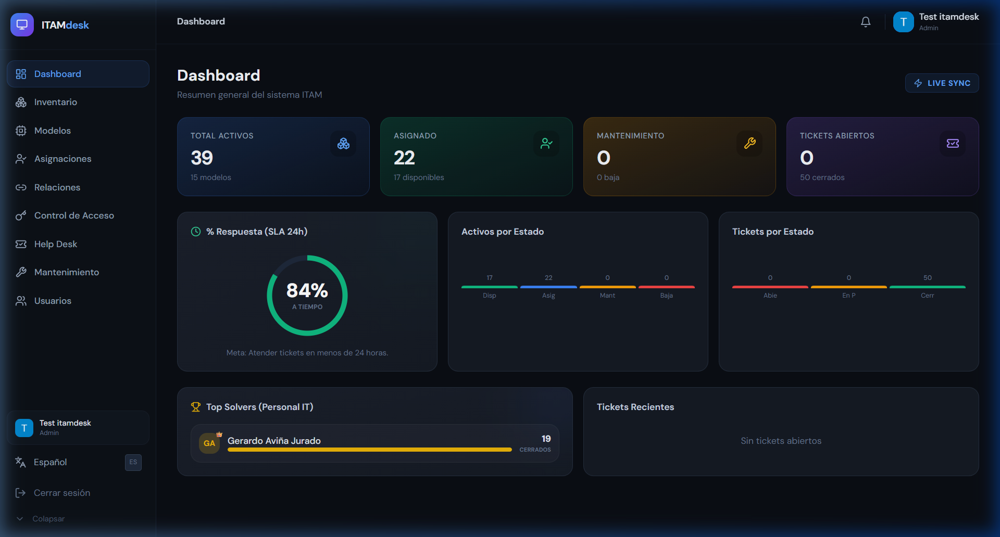
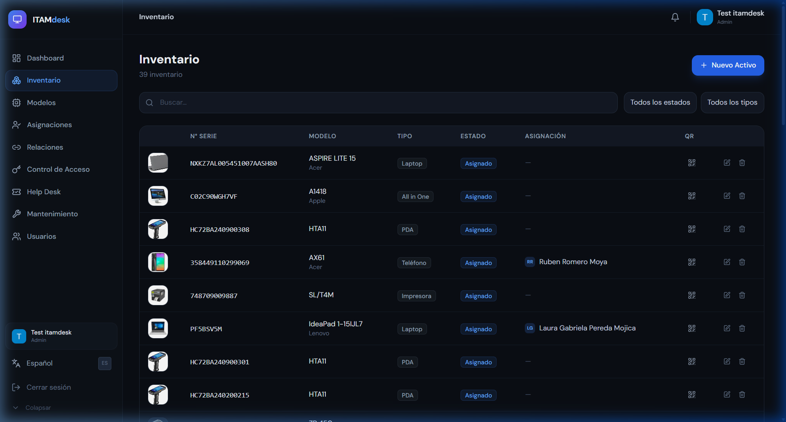
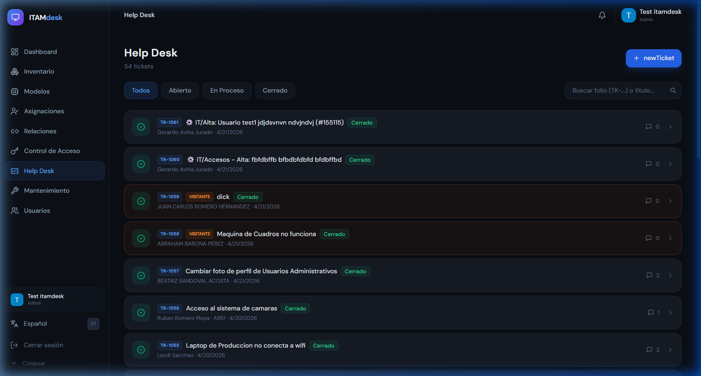
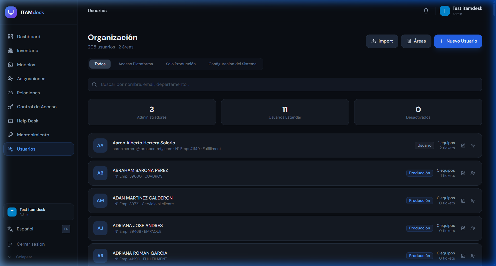
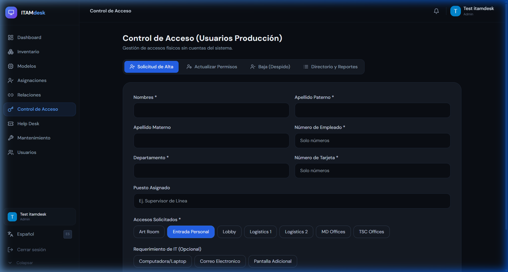

# Guía de Administrador y Soporte IT: ITAM Desk

Esta guía está dirigida al equipo de Tecnologías de la Información responsable de la gestión de activos, resolución de tickets y control de acceso físico en Prosper Manufacturing.

---

## 1. Panel de Control General (Dashboard)

El Dashboard principal ofrece una vista en tiempo real de la salud operativa del departamento:
*   **Total Activos:** Conteo global de equipos.
*   **SLA 24h:** Porcentaje de tickets atendidos en menos de 24 horas.
*   **Estado de Activos:** Gráfica de equipos disponibles vs asignados o en mantenimiento.
*   **Top Solvers:** Ranking del personal de IT con más tickets resueltos.

---

## 2. Gestión de Inventario

En la sección de **Inventario**, puedes administrar el ciclo de vida de cada equipo:
*   **Filtros Avanzados:** Busca por número de serie, modelo o estado (Asignado, Disponible, Bajo, Mantenimiento).
*   **Código QR:** Cada equipo tiene un QR único para identificación rápida.
*   **Edición:** Haz clic en el icono de lápiz para cambiar el estado de un equipo o reasignarlo.
*   **Nuevo Activo:** Botón azul para dar de alta nuevos equipos en el sistema.

---

## 3. Help Desk (Atención a Tickets)

Es el centro de operaciones para soporte técnico:
*   **Priorización:** Los tickets se organizan por estado (Abierto, En Proceso, Cerrado).
*   **Asignación:** Puedes asignar tickets a miembros específicos del equipo IT.
*   **Comunicación:** Al entrar a un ticket, puedes chatear con el usuario, ver sus fotos de evidencia y enviar soluciones.
*   **Cierre de Tickets:** Una vez resuelto, cambia el estado a "Cerrado" para mantener las métricas de SLA limpias.

---

## 4. Usuarios y Permisos

Desde la sección de **Usuarios**, puedes:
*   Gestionar el personal con acceso a la plataforma.
*   Cambiar roles (Usuario, Admin, RRHH).
*   Desactivar cuentas de personal que ya no labora en la empresa.

---

## 5. Control de Acceso (Puertas)

ITAM Desk también gestiona las solicitudes de acceso a áreas restringidas:
*   **Solicitudes Pendientes:** Revisa quién solicita entrar a qué puerta.
*   **Aprobaciones:** Aprueba o rechaza accesos basados en el perfil del empleado.
*   **Historial:** Registro de quién ha entrado y en qué horario.

---

> [!IMPORTANT]
> Como Administrador, tus acciones afectan directamente las métricas de cumplimiento (SLA). Asegúrate de mantener actualizados los estados de los tickets y del inventario diariamente.
