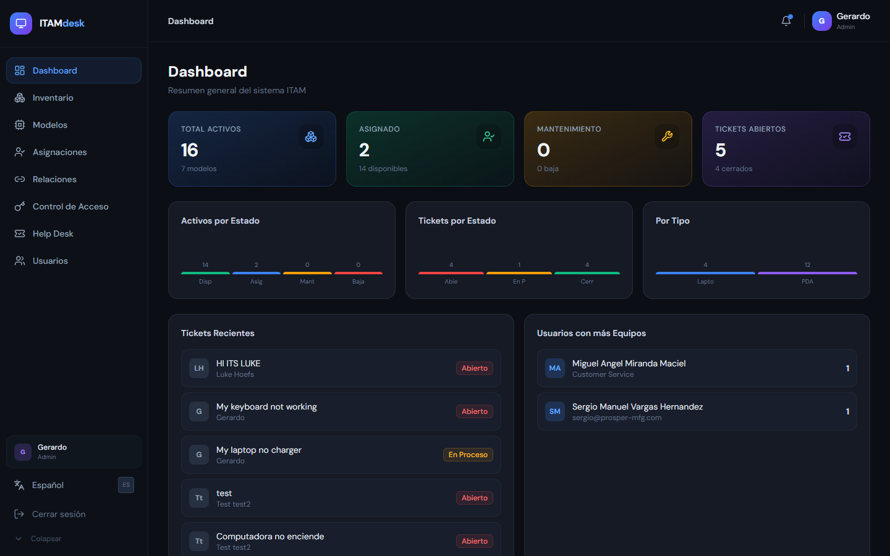
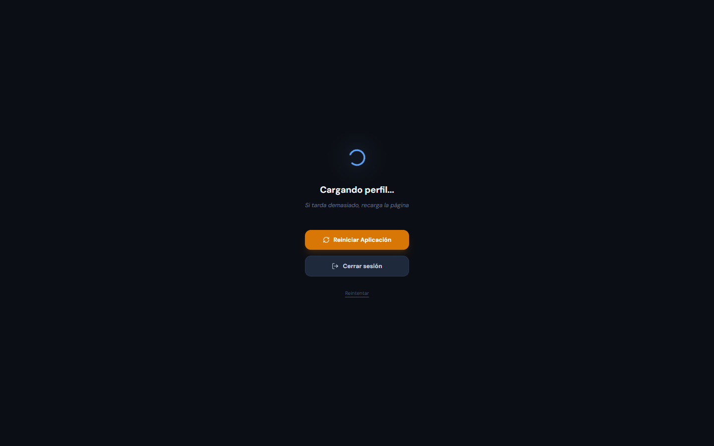
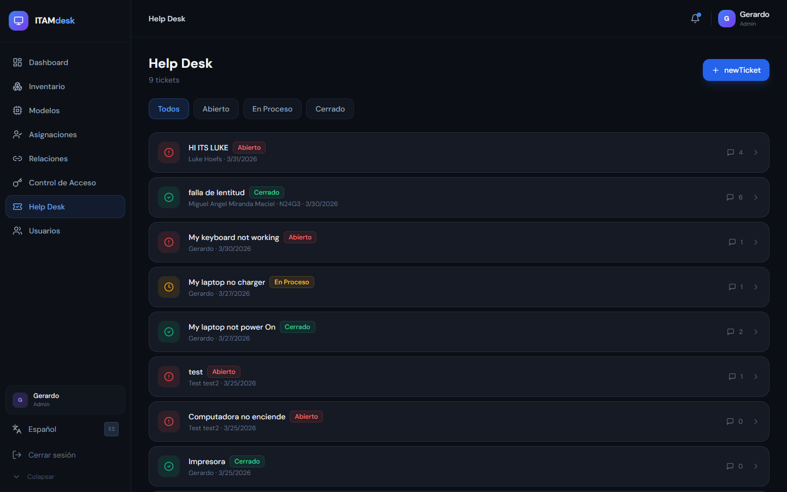
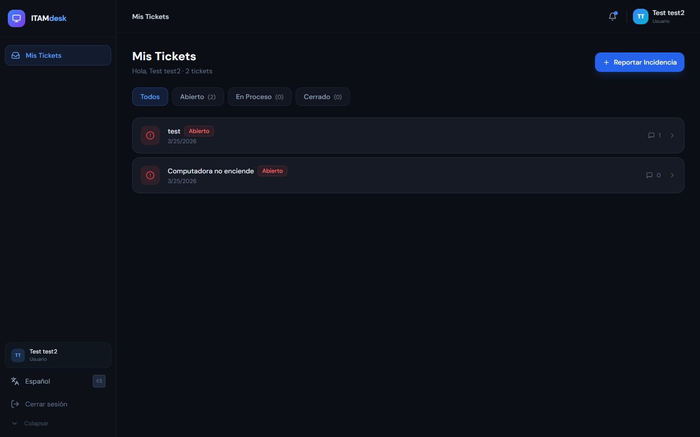

# Manual Ejecutivo y Guía de Sistema: ITAM Desk

## Introducción al Sistema
**ITAM Desk (IT Asset Management Desk)** es una plataforma integral diseñada para optimizar y centralizar la administración de los activos tecnológicos, las solicitudes de soporte (Tickets) y la gestión del ciclo de vida de los usuarios dentro de la organización. 

Este manual está orientado a un perfil ejecutivo, presentando de manera clara y directa las capacidades clave del sistema y cómo generan valor operativo y estratégico, diferenciando la vista de Administración general de la vista para Empleados.

## 1. Módulo de Autenticación (Login)
El sistema requiere autenticación segura para garantizar que la información confidencial de la empresa esté protegida. El acceso está regulado por roles, lo que significa que cada usuario ve únicamente los módulos y opciones correspondientes a su nivel de permisos.

## VISIÓN GENERAL: ROL DE ADMINISTRADOR (IT / RRHH)
Esta sección contiene la vista de un usuario con permisos elevados, el cual tiene acceso completo a los recursos e inventario del sistema.

### 2. Panel Principal (Dashboard)
El Dashboard es el centro de control ejecutivo. Aquí se presentan indicadores clave de rendimiento (KPIs) en tiempo real, permitiendo una visión "a vista de pájaro" del estado actual de los recursos de TI.

**Características principales:**
*   **Resumen de Activos:** Cantidad total de equipos, equipos asignados, en reparación y disponibles.
*   **Estado de Tickets:** Métricas inmediatas de problemas reportados, tiempos de resolución y cuellos de botella.
*   **Gráficos Interactivos:** Visualización rápida del estado general para la toma de decisiones informada.

### 3. Gestión de Inventario (Inventory & Models)
Este módulo es el núcleo del seguimiento de activos. Permite saber exactamente qué equipos existen, en qué estado se encuentran y a quién pertenecen.

**Características principales:**
*   **Control de Equipos:** Registro detallado de cada activo (número de serie, modelo, marca, valores y estado).
*   **Gestión de Modelos:** Categorización de los tipos de equipos para un control estandarizado.
*   **Trazabilidad:** Historial completo del activo desde su adquisición hasta su depreciación o desecho.

### 4. Mesa de Ayuda y Tickets (Tickets)
El módulo de soporte técnico permite centralizar todas las incidencias y requerimientos de los empleados, garantizando que nada se quede sin atender.

**Características principales:**
*   **Seguimiento de Incidencias:** Desde la creación del reporte hasta su cierre.
*   **Priorización y Asignación:** Permite escalar problemas críticos a diferentes técnicos o departamentos.
*   **Historial de Soluciones:** Crea una base de conocimientos implícita sobre los problemas más frecuentes de la empresa.

## VISIÓN GENERAL: ROL DE USUARIO / EMPLEADO
El sistema está diseñado para que cualquier empleado normal tenga su propio portal, enfocado exclusivamente en sus necesidades de atención y responsabilidad sobre sus equipos de trabajo.

### 5. Portal del Empleado (User Portal)
Cuando un empleado (no administrador) inicia sesión, el sistema oculta los controles sensibles e inventario global, y lo lleva directamente a su portal personal. 

**Características principales:**
*   **Mis Equipos Asignados:** El empleado puede visualizar qué equipos tecnológicos están bajo su resguardo legal en la empresa (ej. su laptop o celular).
*   **Soporte Inmediato:** Desde aquí, el usuario puede crear nuevos tickets de soporte técnico o ver el estado de avance de sus reportes anteriores.
*   **Simplicidad:** Interfaz limpia sin opciones confusas, lo que reduce la curva de aprendizaje a cero.

## Conclusiones para la Dirección
La adopción de **ITAM Desk** proporciona valor estratégico al:
1.  **Reducir costos ocultos** previniendo la pérdida o extravío de activos valiosos.
2.  **Aumentar la productividad** al minimizar los tiempos caídos de los empleados esperando soporte o equipo.
3.  **Auditar la infraestructura de TI** asegurando que las compras de hardware sean justificadas en base a datos reales.
