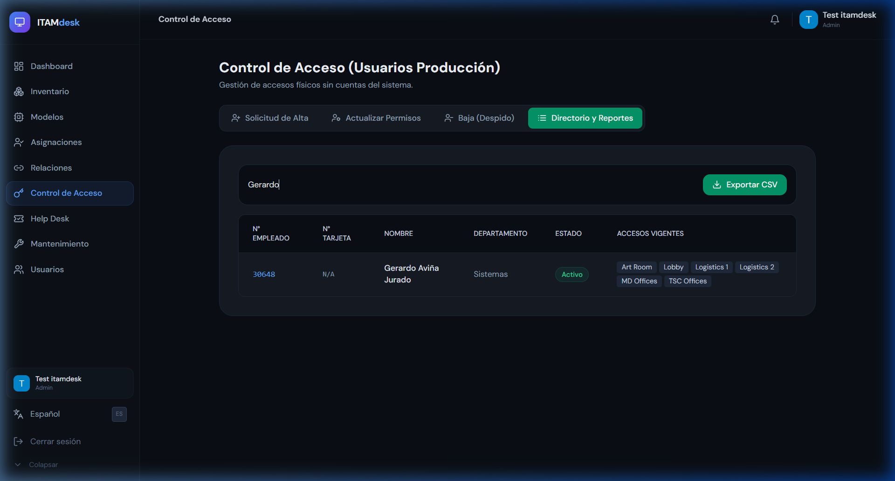
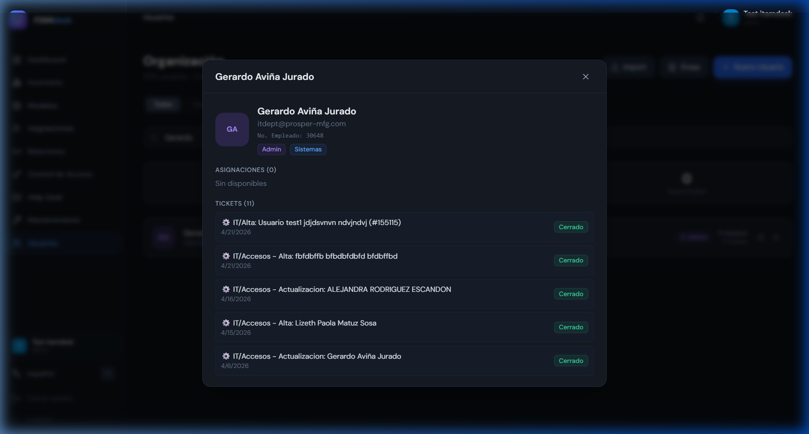

# Guía de Recursos Humanos: ITAM Desk

Esta guía está diseñada para que el personal de Recursos Humanos pueda consultar la información de los empleados, sus activos asignados y su historial de interacción con el departamento de IT.

---

## 1. Consulta de Empleados (Directorio)

El portal permite una búsqueda rápida de cualquier colaborador de la empresa:
*   **Búsqueda Inteligente:** Puedes buscar por Nombre o por Número de Empleado.
*   **Filtros de Área:** Identifica rápidamente a qué departamento pertenece el empleado y su estatus actual en la empresa.

---

## 2. Detalle del Colaborador

Al seleccionar un empleado, se despliega una ficha técnica completa que incluye:
*   **Información de Contacto:** Correo institucional y puesto.
*   **Asignaciones (Activos):** Lista de todos los equipos (Laptops, periféricos, móviles) que el empleado tiene bajo su resguardo legal. Esto es vital para procesos de "Baja" o desvinculación.
*   **Historial de Tickets:** Registro de todas las solicitudes de soporte que el empleado ha realizado, permitiendo identificar patrones de problemas técnicos recurrentes.

---

## 3. Utilidad para Procesos de RH

### A. Altas de Personal
RRHH puede verificar que los nuevos empleados hayan sido dados de alta correctamente en el sistema y que sus equipos iniciales hayan sido asignados por IT.

### B. Bajas de Personal (Checklist)
Antes de finalizar una relación laboral, RRHH debe consultar el apartado de **Asignaciones** para asegurar que el empleado devuelva todos los activos listados en ITAM Desk.

---

> [!TIP]
> Puedes exportar la lista de empleados y sus activos a un archivo CSV para auditorías externas o reportes de nómina relacionados con herramientas de trabajo.
