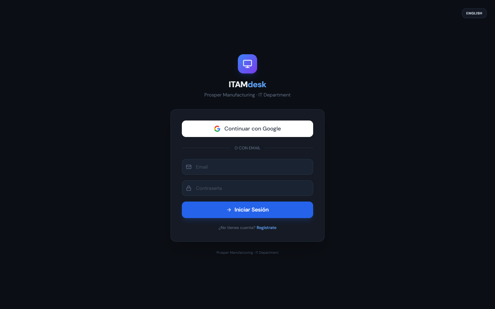
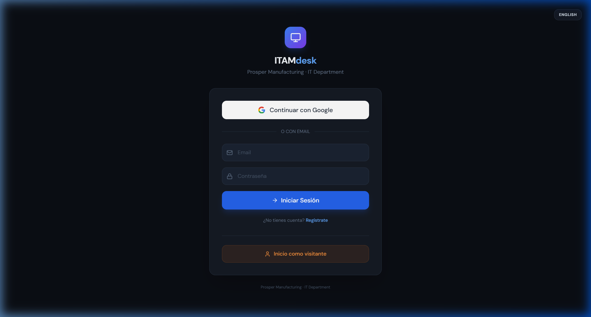
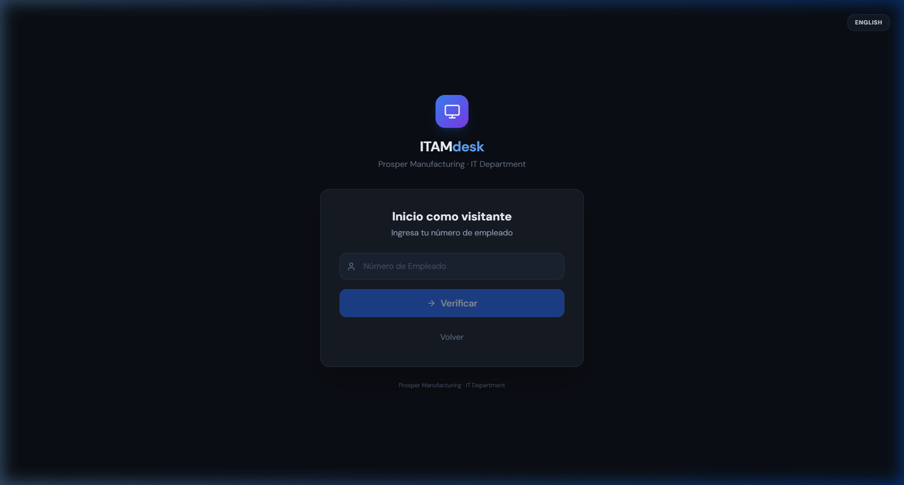
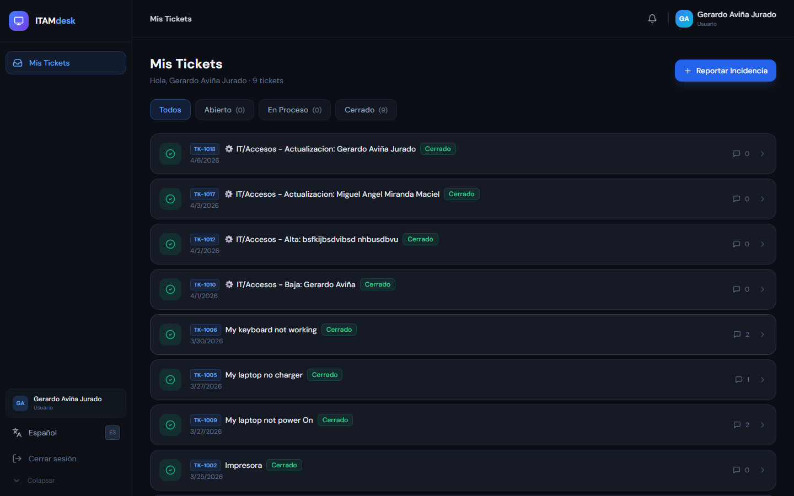
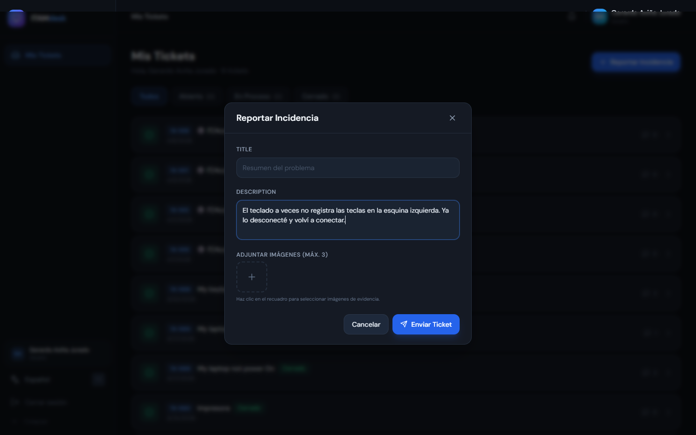
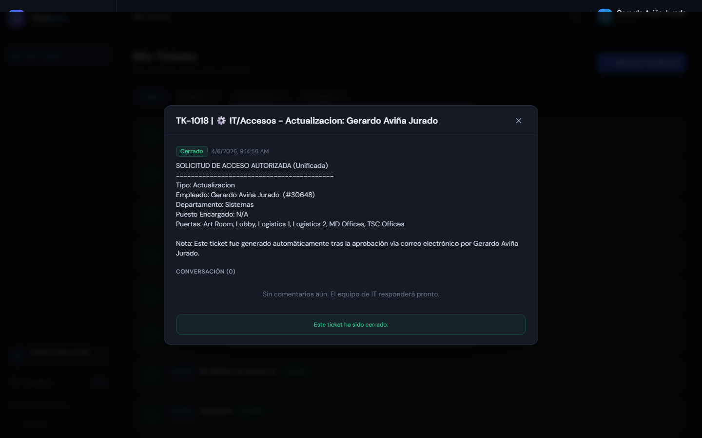

# Guía de Usuario: ITAM Desk (Personal con Acceso)

¡Bienvenido a **ITAM Desk**! Esta plataforma es el canal oficial para reportar cualquier incidencia técnica, solicitar equipo o recibir soporte del departamento de IT de Prosper Manufacturing.

---

## 1. Acceso a la Plataforma

Puedes acceder a la plataforma de dos maneras principales:

### A. Inicio de Sesión con Google (Recomendado)
Haz clic en el botón blanco **"Continuar con Google"**. Esto vinculará tu cuenta institucional automáticamente sin necesidad de recordar una contraseña adicional.

### B. Inicio de Sesión con Correo
Si prefieres usar tu correo y una contraseña específica para ITAM Desk, introduce tus credenciales y haz clic en **"Iniciar Sesión"**.

---

## 2. Modo Invitado (Sin Registro)

Si te encuentras en las instalaciones de la empresa y necesitas levantar un ticket de manera urgente pero no tienes tu sesión abierta, puedes usar el **Modo Invitado**.

1. Haz clic en el botón naranja **"Modo Invitado"** al final de la pantalla de inicio.
2. Ingresa tu **Número de Empleado**. El sistema validará tu identidad.
3. Completa el formulario con el título y descripción de tu problema.
4. **Nota:** Esta opción solo está disponible cuando estás conectado a la red interna de la empresa.

|  |  |
| :---: | :---: |

---

## 3. Tu Panel de Control

Una vez dentro, verás el resumen de tus actividades:

*   **Mis Equipos:** Verás los activos (Laptops, Monitores, etc.) que tienes asignados legalmente.
*   **Mis Tickets:** Una lista de todos tus reportes actuales y pasados con su estado (Abierto, En Proceso, Cerrado).

---

## 4. Cómo Reportar una Incidencia (Levantar Ticket)

Para solicitar ayuda, sigue estos pasos:

1. Haz clic en el botón azul **"+ Reportar Incidencia"**.
2. **Equipo (Opcional):** Si el problema es con un equipo específico que tienes asignado, selecciónalo en la lista.
3. **Título:** Escribe un resumen corto (ej. "Pantalla azul en mi laptop").
4. **Descripción:** Da detalles adicionales que ayuden al técnico.
5. **Evidencia:** Puedes adjuntar hasta 3 fotos directamente desde tu celular o computadora.
6. Haz clic en **"Enviar Ticket"**.

---

## 5. Seguimiento y Comunicación

No necesitas llamar por teléfono para saber el estatus. Haz clic en cualquier ticket de tu lista para entrar al **Chat de Soporte**.

*   Podrás ver las respuestas del técnico de IT.
*   Puedes responder, aclarar dudas o enviar más fotos de evidencia.
*   Recibirás una notificación cuando tu ticket sea resuelto y cerrado.

---

> [!TIP]
> **¿Necesitas ayuda rápida?** Recuerda siempre adjuntar una foto del error; esto ayuda al equipo de IT a resolver tu problema hasta un 50% más rápido.
